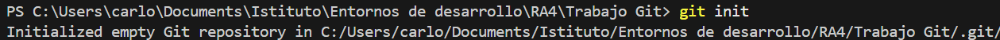
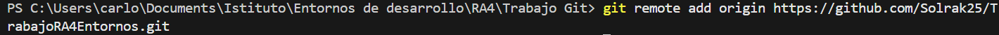
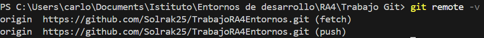
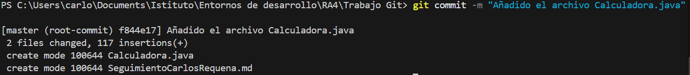
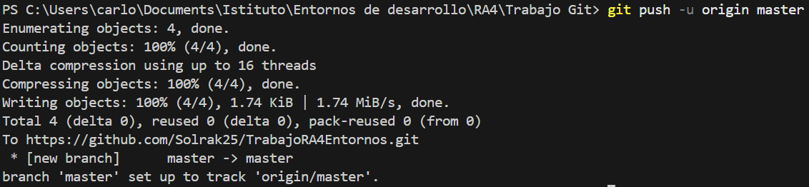
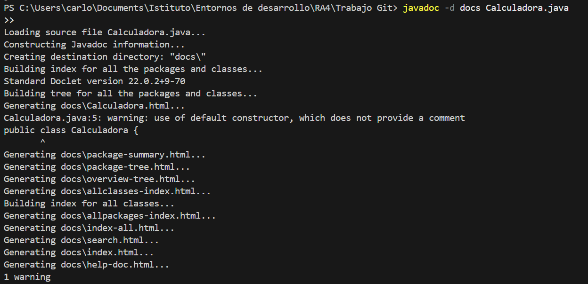
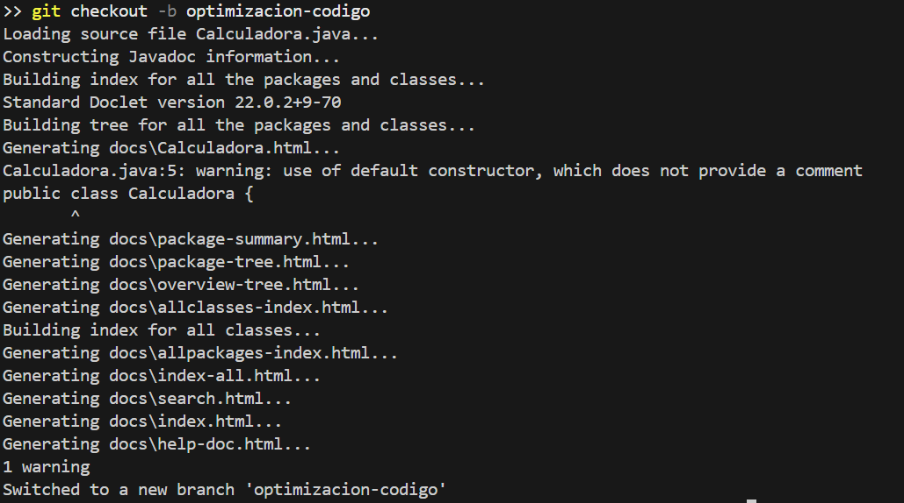
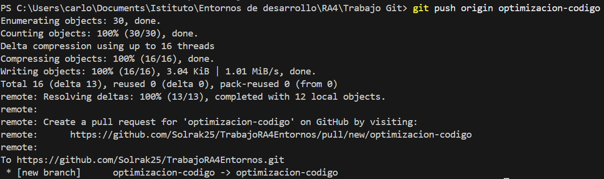
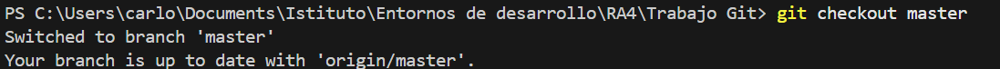
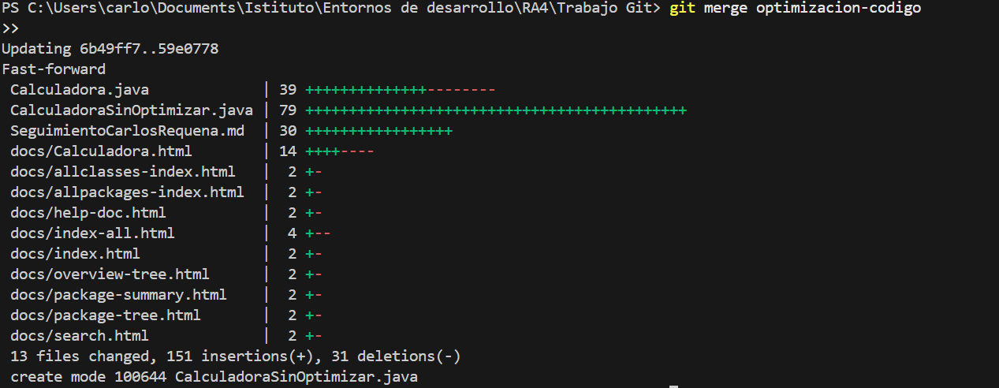

# Trabajo RA4 Uso de Git

## Uso de comandos Git

- Crear el repositorio local
    1. Ir al directorio que queramos  
        `cd /ruta`
    2. Inicializar el repositorio  
        `git init`
- Añadir archivos
    1. Añadir un archivo  
        `git add archivo.md`
    2. Añadir todos los archivos  
        `git add .`
- Configurar un repositorio remoto
    1. Crear un repositorio en GitHup  
    2. Vincula el repositorio remoto al local  
        `git remote add origin https://github.com/usuario/repositorio.git`
    3. Verificar  
        `git remote -v`
- Sincronizar con el repositorio remoto
    1. Enviar los cambios al repositorio remoto  
        `git push -u origin main`
    2. Descargar cambios del repositorio remoto  
        `git pull origin main`
- Ramas
    1. Crear una nueva rama  
        `git branch nombre-rama`
    2. Cambiar a la nueva rama  
        `git checkout nombre-rama`
    3. Combinar cambios de una rama con la rama principal  
        `git checkout main`  
        `git merge nombre-rama` 
- Visualización del estado y el historial
    1. Revisar el estado del repositorio  
        `git status`
    2. Mostar el historial de commits  
        `git log`
- Clonar y colaborar
    - Clonar un repositorio existente  
        `git clone https://github.com/usuario/nombre-repositorio.git`

## Generación de documentación para Java, con Javadoc
- Crear el programa en java  
    - Yo he creado un programa de calculadora sencillo sin funciones para despues optimizar
- Añadirle comentarios java doc, como:  
    - `@param a El primer número a sumar`  
    - `@param b El segundo número a sumar`  
    - `@return La suma de los dos números`
- Hay que usar el comando para crear el javadoc  
    - `javadoc -d docs archivo.java`

## Optimizacion del codigo
- Para la optimizacion primero hay que er que podemos mejorar en el codigo
- Despues vamos a crear una rama dentro del directorio  
    - `git checkout -b optimizacion-codigo`
- Realizar los cambios pertinentes para la optimizacion
- Guardado de los cambios
    - `git add .`
- Crear un comit
    - `git commit -m "Descripcion"`
- Se puede subir la rama al repositorio de GitHup para guardarla  
    - `git push origin optimizacion-codigo`
- Vuelvo a la rama principal
    - `git checkout main`
- Fusionar las ramas
    - `git merge optimizacion-codigo`
- Realizar un commit para guardar u sibir a GitHup

## Imagenes
- 1  
 
- 2   
  
- 3  
  
- 4  
  
- 5  
 
- 6   
  
- 7  
  
- 8  

- 9  
 
- 10  
 
- 11  
 
- 12  
 
